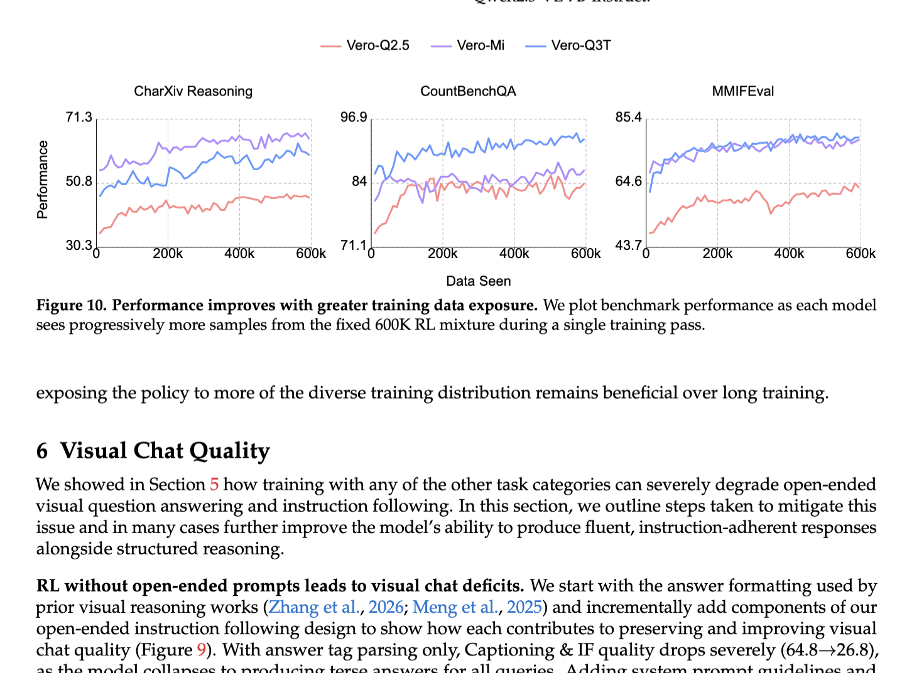
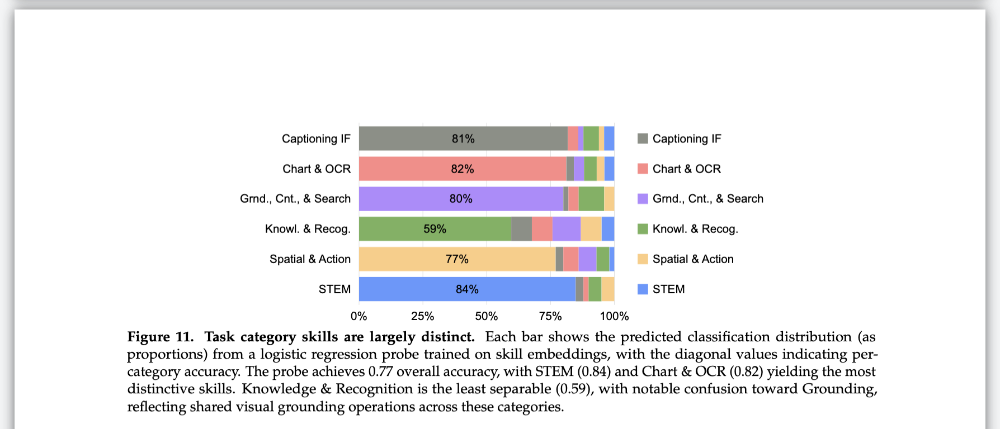

**Writing Guide - Zhuang Liu Lab @ Princeton University**

*By [Zhuang Liu](https://liuzhuang13.github.io/)*

[中文版](README_CN.md)

**Related**: [Figure Guide](https://github.com/zlab-princeton-internal/figure-guide) · [Paper Checking Prompt](https://github.com/zlab-princeton-internal/paper-checking-prompt) · [Peer Review System](https://github.com/zlab-princeton-internal/peer-review)

> This guide is intended for [Zhuang Liu](https://liuzhuang13.github.io/)'s group members. Others are welcome to adopt or adapt it for their own use.

**Good writing boosts the paper's contributions to the scientific community by providing more clarity on your messages. For your own benefit, good writing helps the work disseminate, and it is often a night-and-day difference. You've put in months of hard work on the project, and it is absolutely worth it to improve the writing by following this guide.**

**1\. Please read through this guide before you start writing, so we get it right the first time.**   
**2\. Even with a full draft ready, in past students’ experience, it can take at least 5 days’ full-time work to meet all requirements. Please go through each requirement very carefully, and start early.**

# **Focus - Readers & Core Contributions & Evidence**

**G.1 Keep in mind you are writing for the readers, not writing for yourself.** This is the overall guiding principle. You should make the readers comfortable and able to grab what it is as effortlessly as possible. Most of the requirements below are for this purpose. For example, one straightforward corollary:

* Do not use terminologies or introduce new ones unless *absolutely* necessary. This makes the readers need to decode what it is every time. Most good papers only have one new term (e.g., Transformer, ResNet).   
        
      
**G.2** **Make it very clear what your most significant contributions are.** Say it very explicitly and concisely, and do not let the readers guess or parse. This should typically be describable in 2-3 sentences. You don't have to do a contribution item list at the end of the intro, though. Discuss it explicitly and in a structured manner in the abstract and introduction. Repeat/paraphrase at other places multiple times.

**G.3 Make sure the majority of your experiments are evidence to support the core contributions, not other “interesting” side analysis/phenomenon.** Make sure they are solid enough to convince the readers about your core contributions & findings. Usually, this means various datasets/settings and comparisons with all the essential baselines, all to support the core claims.

**G.4 Do not overclaim.** We are happy with “smaller” contributions but not with exaggerated claims. When not sure, lean on the rigorous side. This sometimes means adding appropriate conditions to your conclusions.

**G.5** Make sure the section/subsection length for the core contribution part (e.g., method, benchmark creation process, or empirical analysis, depending on what your claimed contribution is) has appropriate length and detailed enough. After all, it is your core contributions, unless you would like to emphasize that you did not do much (simplicity).

## **Structure & Flow (paragraphs, sections, narrative)**

**S.1** Most of your paragraphs should be 5-8 lines long (excluding citations). 9 lines are close to the maximum acceptable. Each paragraph should be about a single point, and a reader should be able to summarize each paragraph in one short sentence effortlessly. If not, split it. If a paragraph is less than 3 lines, merge it with the other paragraph.

**S.2** Don't make the abstract too long. 15-17 lines max (in single column format). [This paper](https://arxiv.org/pdf/2403.08632) only has 10 lines. 

**S.3** Do not use too long section/subsection titles, 1-4 words max. Do not use subsubsections. If you need to say a summarizing sentence, say it at the start of the text (maybe bold), not as the title.

**S.4** Don't try to squeeze things too much now. Don't worry about the 9-page limit until the last *24* hours. Make sure it is good-looking, not too crowded, and can be read without stress.

**S.5** **Do not put method-level details in the introduction.** The intro should convey the high-level problem, motivation, and contributions. Specifics like which data version you use, which tool you apply, or which hyperparameters you choose belong in the method section. If a reader needs context you haven't introduced yet to understand a phrase in your intro, move it later.

**S.6** **Use engaging, specific section titles instead of generic one-word labels.** Titles like "Analysis," "Applications," or "Interpretability" are vague and forgettable. If a section has a central question or finding, use it as the title. For example: "Where Is the Signal?" instead of "Interpretability," or "Grounding Agent Reviews" instead of "Applications." Question-form titles work especially well for analysis sections.

**S.7** **The conclusion must go beyond the abstract.** You can briefly restate the key results, but the conclusion must add implications, interpretation, or forward-looking discussion that the abstract does not contain. A conclusion that merely paraphrases the abstract wastes space and reads as filler. Consider using "Conclusion and Discussion" as the section title — this naturally invites deeper reflection and avoids the trap of a pure summary.

## **Citations & Related Work**

**C.1** Make sure to get all citations precise, i.e., it is relevant to the thing you are saying and also more relevant than the ones you don't cite (i.e., they are relevant and the most relevant). Make sure to use \\citet and \\citep correctly:
* **\\citep** = the citation is NOT a sentence component. "...as shown in prior work \\citep{tong2024}" renders as "...as shown in prior work (Tong et al., 2024)"
* **\\citet** = the citation IS a sentence component. "\\citet{tong2024} show that..." renders as "Tong et al. (2024) show that..."
* Simple test: if you remove the citation and the sentence is still grammatically complete, use \\citep. If removing it breaks the sentence, use \\citet.

Cite in time order if multiple (A et al. 2023; B et al. 2025).

**C.2** For related works, use **\\paragraph{}** to set topic titles, not subsections.

**C.3** Citation density should be healthy, not too many, not too few, not too heavy at certain places, and too light at others.

**C.4 For citation format, look at [this paper](https://arxiv.org/pdf/2403.08632) for reference.**

* **For conferences like CVPR, ICML, only use the 4-letter abbreviation, not the full name.**   
* **Delete the page/volume info, etc, for all entries.**  
* **For conferences we should use @inproceedings, and for arXiv use @article, for the bib entry.**   
* **Check if a paper has a published version. If there is, use it in .bib instead of the arXiv version.**  

**C.5** If you are unsure about anything regarding formatting, check what [this paper](https://arxiv.org/pdf/2403.08632) did. Use a soft color for citations (no red, pink, or light green). You can use the blue color of the referred paper - download the LaTeX files from arXiv.

**C.6** Make sure to have a white space between citations and text. It's easy to miss some even if you are aware.

**C.7** Related work should not be too long. Usually, 2-3 solid paragraphs (6-8 lines excluding citations) is enough. 4 is likely max.

**C.8** Set a proper paragraph space. Paragraphs should not be too far or too close.

**C.9**  Make sure to keep a consistent capitalization format in \\textbf{} paragraph title.

**C.10** Make sure to have 60+ references at the end. Depending on topics, we may need even more (for more mainstream topics, 90+ is common).

**C.11** **Do not have duplicate reference entries. This can happen more than we think.**

**C.12** Make sure we are citing to the right paper. Sometimes two papers can share the same method name (e.g., XXGPT) but they are different papers.

**C.13** **Ensure every cited reference actually exists.** Every entry in your `.bib` file must correspond to a real, published or publicly available paper. Verify that the title, authors, and year are correct — do not rely on LLM-generated bib entries without checking. A wrong author, a made-up title, or a non-existent paper in your reference list is a serious error that undermines credibility.

## **Language Style & Tone**

**L.1** Cut/shorten a word or phrase without losing any meaning, whenever you can. e.g., xx is a method that does .... -\> xx does …

**L.2** Cut/replace any word that might hint it is ChatGPT-generated, even very slightly. e.g., delve.

**L.3** Use a mix of long and short sentences. Do not overuse "which", "that", "and", "xxing (e.g., highlighting, demonstrating). You can start a new sentence in such cases.

**L.4** Use a consistent simple present tense in each section, except maybe for related work, you may choose to use the past tense (but simple present still works).

**L.5** Do not use objectively good words to describe your contribution, e.g., novel, critical, great. This does not boost the readers' perception of the work. You can use words like new, comprehensive, if applicable.

**L.6** Do not bold text if it is not necessary. Do not capitalize the first letters of words/sentences if not necessary. Too many capital letters look messy. For example, capitalization is usually not required after "-" or ":".

**L.7** Do not use contraction (isn't =\> is not, don't =\> do not)

**L.8** Install Grammarly extension on web browser and make sure it is working in checking grammar/spelling on Overleaf.

**L.9 Do not have more than a couple of dashes (---, --, -) in the paper, unless we absolutely need it. If AI writes any dashes, be sure to remove it.**

**L.10** **Do not make claims about what is "commonly assumed" or "widely believed" without a citation.** If you write "X is commonly assumed," a reviewer can always ask: commonly assumed by whom? Either cite a source that establishes the assumption, or rephrase to avoid the claim. For example, instead of "substantially more than commonly assumed," write "a substantial portion of X is recoverable."

## **Figures & Tables (design, readability, placement)**

**F.1** Check legends, titles, ticks, text in figures, and make them the appropriate size (text should be of a similar size to captions).

**F.2** Crop the white space of figures when they are generated, so we do not waste space on paper. Ensure your figures utilize all the available white space to the left and right (unless you intentionally leave some space there).

**F.3** For figures, use PDF as much as possible so that resolution is not lost when zooming in. Make sure the text in figures is selectable on the paper pdf.

**F.4** Use Arial fonts for all text in figures by default, unless you are intentional about using a different, and more good-looking one. Do not use serif fonts (e.g., Times New Roman) in figures in any case. 

**F.5** All figures and tables must be referred to at least once in the text.

**F.6** In most cases, the table looks nicer after you remove all vertical lines. Look how *Kaiming*'s papers never have vertical lines in tables (see the table below).

**F.7** Put table and figure captions all below, not above. It's okay to ignore the conference instructions for this if they tell you otherwise.

**F.8** For figures, 

* Some references on colors are: **\#483e8c**, **\#1b76d2**, **\#dc8969**  
* Some other recommendations: use a pure black border for boxes, a sharp arrow.  
      

**F.9** **Y-axis tick values must be round numbers.** Do not let matplotlib auto-generate tick values from the data range — values like 30.3, 71.1, 96.9 are not acceptable. Manually set ticks to clean integers (e.g., 30, 50, 70).

> **Bad example** — Y-axis ticks are auto-generated decimals (30.3, 50.8, 71.3, etc.). Also note the widow line at the top of the page.
>
> 

**F.10** **Do not let a single line of text from the previous section spill onto the next page ("widow").** Rewrite to pull it back or push more text forward. See the bad example in F.9 above — there is also a widow line at the top of that page.

**F.11** **Do not place a narrow/sparse figure at the top of a page with large whitespace on both sides.** Use `wrapfigure` to embed it alongside text, or place it mid-page with text above and below.

> **Bad example** — A narrow figure at the top of the page.
>
> 

**F.12** **Show failure cases**, especially for VLM, VQA, and generation work. Put them in the appendix (or main body if space allows). Showing failures makes the paper more credible and helps readers see what is actually happening — papers that only show successes look less trustworthy.

## **Numbers & Precision**

**N.1** Use the right precision for results. In almost all cases, 81.23% is not necessary; just do 81.2%.

N.2 Either use numbers that are in a math environment ($82.8$) or not (82.8), but consistently.

## **Terminology, Abbreviations & Consistency**

**T.1** When an abbreviation appears for the first time, you need to say the full name. Do not assume readers know what it is. Unless it is a one with a citation to a specific previous work.

**T.2** Use the correct expression for "i.e.", "e.g.".

**T.3** Be consistent in your writing. 

* Either use italic for "e.g." or not, but pick one throughout the whole paper.   
* Don't use short and long dashes alternatively.  
* Don't use, e.g., "GPT-5-thinking" here and "GPT-5 (thinking)" there.   

## **Project Hygiene, Tooling & Templates** 

**P.1** Use this [template](https://colab.research.google.com/drive/1qNRjVUKKWr_9oKR1StkBW4ojTWewuq2W?usp=sharing) for your plots. Pay attention to the way it uses ticks, font sizes, grids, legends, etc. You can change the colors.

**P.2** Sync your Overleaf with Dropbox (and use the Dropbox desktop version) for easier figure updates, and for backup if Overleaf goes down.

**P.3** Use a single .tex file (do not separate into abstract.tex, intro.tex, etc.) so that Overleaf search over the whole paper is possible. Delete any old unused .tex files, as they can be confusing for collaborators.

**P.4** Use latex commands for the method name and shortened method name, as they may need to be changed later.

**P.5** **Only one `.tex` file in the root directory, named `main.tex`.** Do not have multiple `.tex` files scattered in the root (e.g., `paper_v2.tex`, `submission_icml.tex`, `old_draft.tex`). If you have different versions for different venues (ICML submission, arXiv version), keep only the current active version as `main.tex`. Back up outdated versions locally and delete them from Overleaf so collaborators are never confused about which file to edit.

**P.6** **Remove outdated files.** Old figures, unused `.bib` files, previous submission versions, `rebuttal.tex`, etc. should be removed from the Overleaf project before sharing or submitting. Back up locally first if needed, then delete from Overleaf. A clean project is easier to navigate and less error-prone.

## **Appendix**

**AP.1** **Apply the same writing and layout standards to the appendix as to the main body.** All rules in this guide — layout, figures, formatting, paragraph structure — apply equally.

**AP.2** **If the appendix is long (>5 pages), add a table of contents at the beginning.** Use `\minitoc` or a manual list with `\hyperref` links to each appendix section.

**AP.3** **Do not have a page with a single small figure and large whitespace.** Combine it with another figure, add text around it, or resize it.

**AP.4** **Do not have excessive whitespace around figures.** Figures should be sized and positioned to fill the page naturally.

**AP.5** **Keep paragraph formatting consistent.** Pick one style (e.g., new line after bold heading vs. continuing on the same line) and use it throughout.

**AP.6** **Appendix paragraphs should not all be 1–3 lines.** Merge related points into substantive paragraphs. They can be shorter than main body paragraphs, but should still be real paragraphs.

**AP.7** **Consider using `\newpage` at section boundaries to isolate layout impact.** Moving one figure in a figure-heavy appendix often cascades into layout problems on subsequent pages. `\newpage` at section breaks prevents this — but do not use it if it would leave the previous page more than half empty.

## **LLM Use**

**G.0** Do not copy-paste whole paragraphs; only take suggestions.

**G.1** Use discretion and judgement when incorporating LLM suggestions. 

**G.2** Send both the PDF and the .tex file to GPT. Use this prompt at least “Please find all grammar/punctuation errors, typos, and inconsistencies. Go through the paper very carefully.” Claude Code and Codex are also good at this task.

**G.3** For the process above, use multiple LLMs (GPT-Pro, GPT-Thinking, GPT-instant, Gemini-Pro, Gemini-Thinking, Gemini-Fast, Claude, etc.). For really good models like GPT-Pro, you can use it iteratively (open a new conversation) - it will find new problems in 2nd, 3rd runs.

**G.4** Send each individual paragraph (including all captions and appendix), use this prompt at least “Please propose revision suggestions minimally/only when very necessary”.

**G.5** Send both the PDF and the .tex file to GPT. Copy all of this writing requirement document and ask the model to “check the paper carefully with this requirement document, item by item”. 

## **Conference Submission:**

**SUB.1** No grammar/spelling error/typo (no excuse), **including captions (captions are super important to readers and are subject to many last-minute edits; please don’t forget to check again after editing)**. Use Grammarly, ChatGPT, and Gemini to check for this only, each for one pass if there’s enough time.

**SUB.2** Get rid of the paragraph ending lines with only 1-3 words by shrinking the paragraph slightly.

**SUB.3** Make sure each figure/table is at the most easily readable place, considering the position of the text describing it, usually right below the text for the corresponding experiment settings

**SUB.4** Check the appendix, make sure you don’t forget anything there. Any section/subsection cannot be a table/plot only, which comes with no text description.

**SUB.5** Make the main text *exactly* 8/9 pages as the conference requires, not one line less, not one line more.

**SUB.6** Make sure the abstract in OpenReview is the most up-to-date, not outdated (e.g., version in registering the paper).

**SUB.7** Get rid of latex-related stuff in openreview abstract, e.g., \\citet{}, \\emph{}, \\methodname{}.

**SUB.8** Get rid of all comments made by authors on the PDF.

**SUB.9** Make sure to submit an 8/9-page version to OpenReview 30 minutes before the deadline.

## **arXiv Submission**

**A.1** Check with collaborators/PI what paper category (e.g., cs.CV, cs.ML, cs.CL) is most appropriate for designating as primary and cross-listed on arXiv.

**A.2** Make sure the arXiv abstract page is synced with the PDF abstract (which again is subject to many last-minute changes). Ensure that the math symbols, citations, and links are displayed properly on the abstract page. 

**A.3** If the paper is published/accepted to a conference, note it in the arXiv abstract page comment section.

**A.4** Use Overleaf’s “submit to arXiv” functionality. If it’s the first time you submit to arXiv, ask or check with a collaborator for some help. If really unsure, have collaborators submit the paper on your behalf.

**A.5** Note that arXiv’s submission deadline is 2 pm ET for each day. It will appear online, and we’ll get a link at about 9 pm ET.

**A.6** **Be aware that the full latex source is publicly visible once the paper is on arXiv**. Remove all unnecessary files, unused figures/PDFs, in Overleaf before submitting (e.g., rebuttal.tex). Delete all LaTeX comments in the main.tex file.

**A.7** For most papers we expect to release the code and models under our lab github and huggingface accounts. Contact [Taiming Lu](mailto:tl0463@princeton.edu)for details.

A.8 Use "\\section\*{\\Large Appendix}” at the start of appendix. Do not call it “supplementary materials”.

## **Code Release**

**C.1** Make the links in the repo clickable, use proper markdown in README,  

**C.2** Include conference details after acceptance. 

**C.3** Include paper title, institutions, authors, arxiv links, license, acknowledgement, and bib citations.  

**C.4** Include commands in the main readme for the most important code to run.

C.5 Use Claude Code for better code file organization & naming, and repo naming.

C.6 Use Claude Code for better readme structure. 

## **Useful LaTeX commands:**

* Set paragraph indent:   
  * “\\renewcommand{\\paragraph}\[1\]{\\vspace{1.25mm}”.  
* Set colors:   
  * \\definecolor{citecolor}{HTML}{0071BC} % citation links  
  * \\definecolor{linkcolor}{HTML}{ED1C24} % internal links (refs, TOC, etc.)  
  * \\usepackage\[pagebackref=false, breaklinks=true, colorlinks,  
  *             citecolor=citecolor, linkcolor=linkcolor, bookmarks=false\]{hyperref}  
* URL line breaks:    
  * \\usepackage{url}  
  * \\def\\UrlBreaks{\\do\\/\\do-}  
* Author comments  
  * E.g. \\newcommand{\\ab}\[1\]{{\\color{orange}\[AB: \#1\]}}

---

## TODO

- **Format**: Each rule uses bold for the core rule, followed by a brief explanation in normal text. Examples use collapsible `
` sections.
- **Split compound rules**: Some rules currently cover multiple points — split them into separate items.
- **Add more examples**: Add bad/good examples for more rules (collapsible).
- **Figure guide**: Move figure-related rules (F.*) into a separate Figure Guide document.
